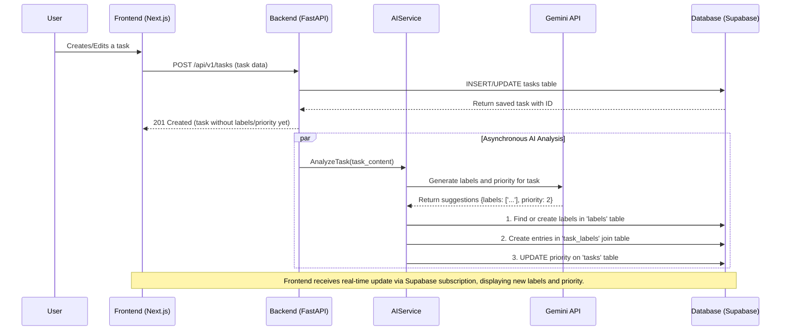
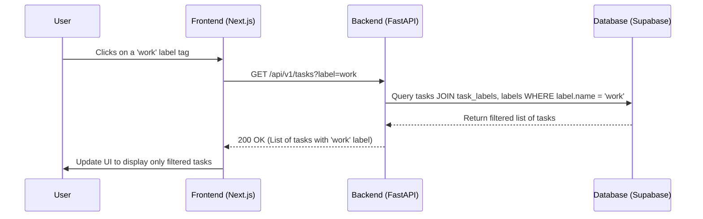

# Epic Technical Specification: AI-Powered Task Intelligence

Date: 2025-11-30
Author: BIP
Epic ID: epic-2
Status: Draft

---

## Overview

This epic, "AI-Powered Task Intelligence," marks the first major integration of AI capabilities into the "Prioritize" application. The primary goal is to enhance task clarity and reduce user cognitive load by automatically analyzing tasks to provide smart categorization and prioritization. This directly addresses the core product vision of transforming a simple to-do list into an intelligent, proactive assistant. This epic covers functional requirements FR8, FR9, and FR10.

## Objectives and Scope

**In Scope:**

*   **FR8: AI-Generated Smart Labels:** The system will asynchronously call the Gemini API from the backend to generate relevant labels (e.g., "work," "personal," "urgent") for each new or updated task. These labels will be stored and associated with the tasks in the database.
*   **FR9: AI-Suggested Priority Levels:** The backend will similarly call the Gemini API to analyze a task's content and suggest a priority level (e.g., 1-4). This priority will be stored on the task record.
*   **FR10: Filter by Smart Label:** The frontend UI will be updated to display the generated labels on each task. Users will be able to click on a label to filter their task list, showing only tasks with that specific label.
*   **Backend API Extension:** The `/api/v1/tasks` endpoint will be modified to accept a `label` query parameter to support filtering.
*   **Database Schema Implementation:** The `labels` and `task_labels` tables will be created and integrated as defined in the architecture document to support the many-to-many relationship between tasks and labels.

**Out of Scope:**

*   Any AI-powered features from other epics, such as task breakdown (Epic 4), time estimates (Epic 4), or the "Just Start Here" button (Epic 4).
*   User interface changes beyond what is necessary to display labels and provide filtering controls.
*   The ability for users to create, edit, or delete labels manually. For this epic, labels are exclusively generated by the AI.

## System Architecture Alignment

This epic's implementation will strictly adhere to the established architectural patterns to ensure consistency and maintainability.

*   **AI Integration Strategy:** All communication with the Gemini 2.5 Pro API will be handled exclusively by the **FastAPI backend**, as mandated by the architecture (Section 4.3). This protects the API key and centralizes prompt engineering, error handling, and fallback logic.
*   **Database Schema:** The implementation will create the `labels` and `task_labels` tables as defined in the database schema (Architecture, Section 4.1), establishing the required many-to-many relationship.
*   **API Design:** The enhancement of the `GET /api/v1/tasks` endpoint to include filtering capabilities follows the versioned RESTful API design principles (Architecture, Section 4.4).
*   **Frontend/Backend Communication:** The Next.js frontend will consume the updated API, sending requests and handling responses via the established type-safe API client.

## Detailed Design

### Services and Modules

| Service / Module | Location | Responsibilities | Inputs | Outputs |
| :--- | :--- | :--- | :--- | :--- |
| **TaskService** | Backend (FastAPI) | Orchestrates CRUD operations for tasks. Triggers asynchronous AI analysis upon task creation/update. Contains logic for filtering tasks by label. | User ID, Task data (from API) | Task objects, Lists of tasks |
| **AIService** | Backend (FastAPI) | Constructs prompts for Gemini API. Manages calls to Gemini for label and priority generation. Parses responses and handles errors/fallbacks. | Task content (title, description) | Suggested labels, Priority level |
| **TaskRepository** | Backend (FastAPI) | Handles all database interactions related to tasks, labels, and their relationships. Encapsulates all SQL queries. | Task/Label data | Database records |
| **TaskStateService** | Frontend (Zustand) | Manages the global state of the task list in the UI. Fetches and caches tasks from the backend. Triggers API calls for filtering. | Filter criteria (e.g., label) | Task list for UI components |
| **LabelTag** | Frontend (React) | A UI component that displays a single label and handles the click event to trigger filtering. | Label name | Click event |

### Data Models and Contracts

The following data model changes are required to support this epic.

**1. Database Schema (SQL)**

A `priority` column will be added to the `tasks` table. Two new tables, `labels` and `task_labels`, will be created to manage the many-to-many relationship.

```sql
-- Add priority to tasks table
ALTER TABLE tasks ADD COLUMN priority INTEGER;

-- Create labels table for unique label names
CREATE TABLE labels (
    id BIGINT GENERATED BY DEFAULT AS IDENTITY PRIMARY KEY,
    name TEXT NOT NULL UNIQUE,
    created_at TIMESTAMPTZ DEFAULT NOW()
);

-- Create task_labels join table
CREATE TABLE task_labels (
    task_id BIGINT REFERENCES tasks(id) ON DELETE CASCADE,
    label_id BIGINT REFERENCES labels(id) ON DELETE CASCADE,
    PRIMARY KEY (task_id, label_id)
);
```

**2. API Data Contracts (Pydantic)**

The `TaskRead` model returned by the API will be updated to include the new fields.

```python
from typing import List, Optional
from pydantic import BaseModel

class TaskRead(BaseModel):
    id: int
    title: str
    is_completed: bool
    # ... other existing fields ...
    priority: Optional[int]
    labels: List[str] = []

    class Config:
        orm_mode = True
```

### APIs and Interfaces

The primary API change is the enhancement of the `GET /api/v1/tasks` endpoint.

**`GET /api/v1/tasks`**

*   **Description:** Fetches tasks for the authenticated user. Now supports filtering by a smart label.
*   **Query Parameters:**
    *   `label` (string, optional): If provided, the API will only return tasks that have this specific label.
*   **Success Response (200 OK):**
    *   **Body:** `List[TaskRead]`
    *   **Description:** Returns a list of task objects. The `labels` property of each task object will be populated with a list of its associated label names.

### Workflows and Sequencing

**1. AI-Powered Task Creation/Update Workflow**

This sequence details how a task is analyzed asynchronously.


```mermaid
sequenceDiagram
    participant User
    participant Frontend (Next.js)
    participant Backend (FastAPI)
    participant AIService
    participant Gemini API
    participant Database (Supabase)

    User->>Frontend (Next.js): Creates/Edits a task
    Frontend (Next.js)->>Backend (FastAPI): POST /api/v1/tasks (task data)
    Backend (FastAPI)->>Database (Supabase): INSERT/UPDATE tasks table
    Database (Supabase)-->>Backend (FastAPI): Return saved task with ID
    Backend (FastAPI)-->>Frontend (Next.js): 201 Created (task without labels/priority yet)

    par Asynchronous AI Analysis
        Backend (FastAPI)->>AIService: AnalyzeTask(task_content)
        AIService->>Gemini API: Generate labels and priority for task
        Gemini API-->>AIService: Return suggestions {labels: ['...'], priority: 2}
        AIService->>Database (Supabase): 1. Find or create labels in 'labels' table
        AIService->>Database (Supabase): 2. Create entries in 'task_labels' join table
        AIService->>Database (Supabase): 3. UPDATE priority on 'tasks' table
    end

    Note over Frontend (Next.js), Database (Supabase): Frontend receives real-time update via Supabase subscription, displaying new labels and priority.
```

**2. Task Filtering Workflow**

This sequence shows how the UI updates when a user filters the list.


```mermaid
sequenceDiagram
    participant User
    participant Frontend (Next.js)
    participant Backend (FastAPI)
    participant Database (Supabase)

    User->>Frontend (Next.js): Clicks on a 'work' label tag
    Frontend (Next.js)->>Backend (FastAPI): GET /api/v1/tasks?label=work
    Backend (FastAPI)->>Database (Supabase): Query tasks JOIN task_labels, labels WHERE label.name = 'work'
    Database (Supabase)-->>Backend (FastAPI): Return filtered list of tasks
    Backend (FastAPI)-->>Frontend (Next.js): 200 OK (List of tasks with 'work' label)
    Frontend (Next.js)->>User: Update UI to display only filtered tasks
```

## Non-Functional Requirements

### Performance

*   **Asynchronous AI Calls:** Calls to the Gemini API for label and priority generation **MUST** be performed asynchronously (e.g., using FastAPI's `BackgroundTasks`) to ensure the initial task creation/update API response is not blocked. The user should see their task appear instantly in the UI.
*   **Database Indexing:** To ensure efficient filtering, indexes must be created on the `labels.name` column and the foreign key columns in the `task_labels` join table.
*   **API Latency:** The `GET /api/v1/tasks` endpoint, including filtering, should respond in under 200ms on average.

### Security

*   **API Key Management:** The Gemini API key **MUST** be stored as a secure environment variable on the backend and managed through Vercel's project settings. It must never be exposed to the frontend.
*   **Data Isolation:** All database queries within the `TaskService` and `TaskRepository` **MUST** be scoped to the authenticated user's ID, leveraging the established RLS policies. This ensures the AI is only triggered for and acts upon data owned by the user making the request.

### Reliability/Availability

*   **AI Service Fallback:** The `AIService` **MUST** implement robust error handling for calls to the Gemini API. If the API call fails, times out, or returns a malformed response, the error must be logged, but the core task creation/update process must not fail. The task will simply exist without AI-generated attributes for the time being.
*   **Idempotency:** The logic for creating labels should be idempotent. If the same label is suggested multiple times, it should not create duplicate entries in the `labels` table.

### Observability

*   **AI Interaction Logging:** All interactions with the Gemini API **MUST** be logged. This includes the full prompt sent to the API and the complete, raw response received. This is critical for auditing, debugging, and refining prompts.
*   **Error Logging:** Any errors encountered within the `AIService` (e.g., API errors, parsing failures, database errors) must be logged with a high severity level.
*   **Performance Monitoring:** The latency of Gemini API calls should be tracked and monitored to identify potential performance degradation over time. This can be done by adding custom metrics.

## Dependencies and Integrations

This epic introduces a new core integration with the Gemini API and updates existing dependencies to support new features.

### Backend Dependencies (FastAPI - `requirements.txt`)

*   **`google-generativeai`**: (New) Essential for programmatic access to the Gemini 2.5 Pro API for generating smart labels and priority levels.
*   **`fastapi`**: Core framework for building the backend API.
*   **`uvicorn`**: ASGI server to run the FastAPI application.
*   **`supabase-py`**: Client library for interacting with the Supabase database.
*   **`pydantic`**: For data validation and settings management.
*   **`pydantic-settings`**: For managing application settings, including API keys.

### Frontend Dependencies (Next.js - `package.json`)

*   **`@supabase/supabase-js`**: Client library for Supabase authentication and real-time features.
*   **`zustand`**: For efficient global state management in the React frontend.
*   **`next`**: React framework for building the frontend application.
*   **`react`**, **`react-dom`**: Core React libraries.
*   **`tailwindcss`**, **`postcss`**, **`autoprefixer`**: For styling with utility-first CSS.
*   **`shadcn/ui`**: (Selected UI library) Provides accessible and customizable UI components.

### Key Integrations

*   **Gemini API (Google)**: Primary integration for AI-powered task analysis. All communication will be server-side (FastAPI).
*   **Supabase**: Continues to serve as the database, authentication provider, and real-time subscription engine.
*   **Vercel**: Deployment platform for the monorepo, handling both Next.js frontend and FastAPI serverless functions.

## Acceptance Criteria (Authoritative)

{{acceptance_criteria}}

## Traceability Mapping

{{traceability_mapping}}

## Risks, Assumptions, Open Questions

{{risks_assumptions_questions}}

## Test Strategy Summary

{{test_strategy}}
