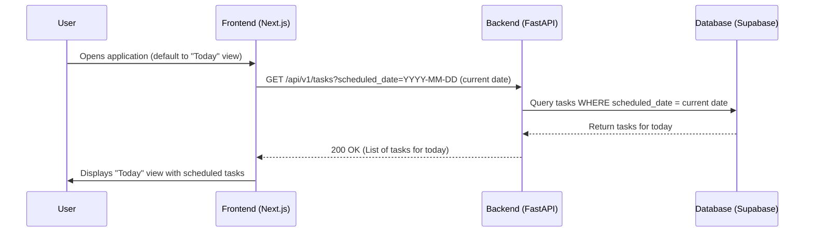
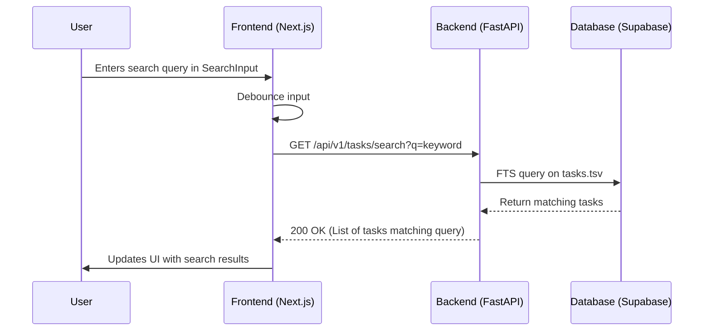
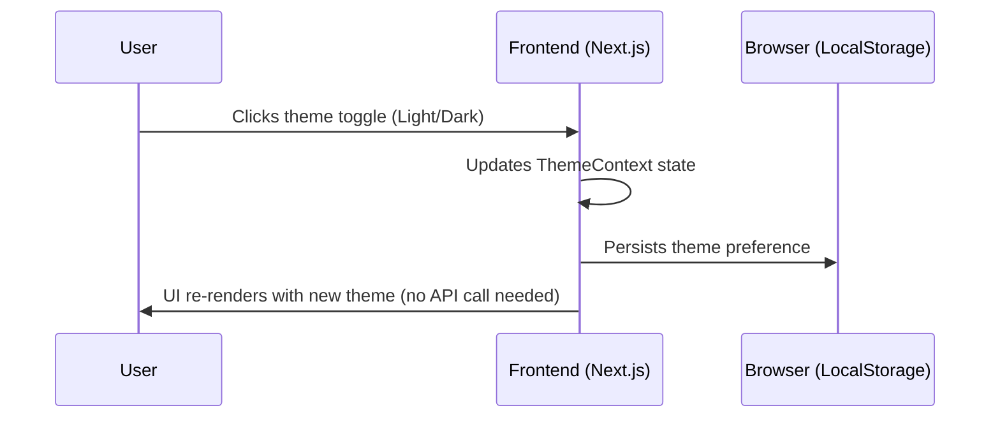

# Epic Technical Specification: Advanced Task Management & User Experience

Date: 2025-11-30
Author: BIP
Epic ID: epic-3
Status: Draft

---

## Overview

This epic, "Advanced Task Management & User Experience," focuses on implementing crucial UI/UX features and advanced task capabilities to significantly enrich the user experience of the "Prioritize" application. It aims to deliver a clean, intuitive, and highly functional interface, along with key features such as a "Today" view, theme switching, and task search. This epic covers functional requirements FR11, FR12, FR13, and FR14, primarily targeting Post-MVP enhancements.

## Objectives and Scope

**In Scope:**

*   **FR11: Minimalist User Interface:** Implementation of the hyper-minimalist and calm aesthetic defined in the UX Design Specification, using `shadcn/ui` components and `Tailwind CSS` for styling. This involves the core layout for the "Proactive Dashboard" and "Focused Task View."
*   **FR12: "Today" View and Filtering (Post-MVP):** Development of a dedicated "Today" view as the default application screen, showing a curated list of tasks for the current day. This requires backend enhancement to filter tasks by date.
*   **FR13: Light/Dark Mode Themes (Post-MVP):** Implementation of functionality to allow users to switch between "Refined Focus" Light and Dark modes, with preference persistence.
*   **FR14: Task Search Functionality (Post-MVP):** Development of a search bar allowing users to find tasks by keywords, backed by PostgreSQL Full-Text Search (FTS) in the backend.
*   **Frontend Component Development:** Creation and integration of new React components as outlined in the UX spec (e.g., search input, theme toggle, date picker).
*   **Backend API Enhancements:** Modifications to the `GET /api/v1/tasks` endpoint to support date-based filtering and a new `GET /api/v1/tasks/search` endpoint for keyword search.
*   **Database Enhancements:** Addition of `scheduled_date` column to the `tasks` table and configuration of PostgreSQL FTS for search.

**Out of Scope:**

*   Any AI-powered features from Epic 2 or Epic 4 (e.g., smart labels, priority suggestions, task breakdown).
*   Any backend infrastructure changes beyond those directly required to support the new UI/UX features (e.g., complex new services).
*   Development of advanced task management features beyond those explicitly listed (e.g., recurring tasks, sub-tasks hierarchies are not part of this epic).

## System Architecture Alignment

This epic's implementation will strictly adhere to the established architectural patterns to ensure consistency and maintainability.

*   **UX Design Principles:** Directly aligns with the "Hyper-Minimalism & Focus," "Intuitive & Gentle Guidance," and "Supportive & Calm Aesthetic" principles outlined in the `ux-design-specification.md`. The implementation will follow the "Proactive Dashboard" design direction and "Refined Focus" color system.
*   **Design System Foundation:** Leverages `shadcn/ui` and `Tailwind CSS` as the chosen design system (UX, Section 1.1; Architecture, Section 8) for consistent and customizable UI development.
*   **Frontend/Backend Communication:** Continues to use the established type-safe API client for communication between the Next.js frontend and FastAPI backend, as defined in the Architecture (Section 3.1).
*   **API Design:** API enhancements for "Today" view and search adhere to the versioned RESTful API design principles (Architecture, Section 3.1).
*   **Search Functionality:** The implementation of task search utilizes PostgreSQL's Full-Text Search (FTS), as outlined in the Architecture (Section 3.2).
*   **State Management:** Frontend state for UI elements and task lists will be managed using `Zustand` and `useState`, following Architecture guidelines (Section 8).

## Detailed Design

### Services and Modules

| Service / Module | Location | Responsibilities | Inputs | Outputs |
| :--- | :--- | :--- | :--- | :--- |
| **TaskService** | Backend (FastAPI) | Handles task CRUD operations. Now includes logic for filtering by `scheduled_date` and keyword search using FTS. | User ID, Task data, filter criteria (date, search query) | Task objects, filtered task lists |
| **TaskStateService** | Frontend (Zustand) | Manages the global state of the task list. Handles API calls for fetching, filtering, and searching tasks. Updates UI state. | Filter/search criteria | Task list for UI components |
| **ThemeContext** | Frontend (React Context) | Manages the application's current theme (Light/Dark). Persists user theme preference to local storage. | User theme selection | Current theme for UI components |
| **SearchInput** | Frontend (React Component) | Provides the UI for task search. Implements debouncing to optimize API calls. | User search query | Search query to `TaskStateService` |
| **DatePicker** | Frontend (React Component) | Allows users to assign `scheduled_date` to tasks. | Date selection | Selected date value |

### Data Models and Contracts

**1. Database Schema (SQL)**

A `scheduled_date` column will be added to the `tasks` table. PostgreSQL Full-Text Search (FTS) will be configured for efficient keyword search.

```sql
-- Add scheduled_date to tasks table
ALTER TABLE tasks ADD COLUMN scheduled_date TIMESTAMP WITH TIME ZONE;

-- Add a tsvector column for Full-Text Search
ALTER TABLE tasks ADD COLUMN tsv TSVECTOR;

-- Create a trigger to update tsv automatically
CREATE OR REPLACE FUNCTION update_task_tsv() RETURNS TRIGGER AS $$
BEGIN
    NEW.tsv := to_tsvector('english', NEW.title || ' ' || COALESCE(NEW.description, ''));
    RETURN NEW;
END;
$$ LANGUAGE plpgsql;

CREATE TRIGGER task_tsv_update
BEFORE INSERT OR UPDATE ON tasks
FOR EACH ROW EXECUTE FUNCTION update_task_tsv();

-- Create an index for the tsv column
CREATE INDEX tasks_tsv_idx ON tasks USING GIN(tsv);
```

**2. API Data Contracts (Pydantic)**

The `TaskRead` model will include `scheduled_date`.

```python
from typing import List, Optional
from datetime import datetime
from pydantic import BaseModel

class TaskRead(BaseModel):
    id: int
    title: str
    is_completed: bool
    scheduled_date: Optional[datetime] # New field
    # ... other existing fields ...
    priority: Optional[int]
    labels: List[str] = []

    class Config:
        orm_mode = True
```

### APIs and Interfaces

New and enhanced API endpoints will support the UI/UX features.

**`GET /api/v1/tasks` (Enhanced)**

*   **Description:** Fetches tasks for the authenticated user. Now supports filtering by `scheduled_date`.
*   **Query Parameters:**
    *   `scheduled_date` (date-string, optional): If provided (e.g., "YYYY-MM-DD"), the API will return tasks scheduled for that specific date. Can be used for "Today" view.
*   **Success Response (200 OK):**
    *   **Body:** `List[TaskRead]`
    *   **Description:** Returns a list of task objects, filtered by date if specified.

**`GET /api/v1/tasks/search` (New)**

*   **Description:** Searches tasks by keyword using PostgreSQL Full-Text Search.
*   **Query Parameters:**
    *   `q` (string, required): The keyword(s) to search for in task titles and descriptions.
*   **Success Response (200 OK):**
    *   **Body:** `List[TaskRead]`
    *   **Description:** Returns a list of task objects matching the search query.

### Workflows and Sequencing

**1. "Today" View Workflow**



**2. Task Search Workflow**



**3. Theme Toggle Workflow**



## Non-Functional Requirements

### Performance

*   **Frontend Rendering:** Optimize React component rendering, especially for potentially large task lists, to ensure smooth 60fps animations and transitions, crucial for a fluid and minimalist UI. This includes virtualizing long lists if necessary.
*   **API Latency:** The `GET /api/v1/tasks` (with date filter) and `GET /api/v1/tasks/search` endpoints **MUST** respond within 100ms for typical loads. This requires efficient database queries and proper indexing of the new `scheduled_date` and `tsv` columns.
*   **Search Responsiveness:** Search results should update near-instantaneously as the user types (after debouncing), providing a seamless experience.
*   **Theme Switching:** Theme changes (light/dark mode) **MUST** be instantaneous and flicker-free, ensuring a smooth user experience.

### Security

*   **Authentication & Authorization:** All new and enhanced API endpoints (`GET /api/v1/tasks?scheduled_date`, `GET /api/v1/tasks/search`) **MUST** enforce user authentication and authorization via JWTs.
*   **Row Level Security (RLS):** RLS on the `tasks` table **MUST** be correctly configured and enforced for the new `scheduled_date` filter and FTS search results to prevent unauthorized access to other users' tasks.
*   **Input Sanitization:** Search query inputs on the backend **MUST** be rigorously sanitized to prevent SQL injection or other query manipulation vulnerabilities, especially given the direct use of FTS.

### Reliability/Availability

*   **Search Robustness:** The backend search functionality **MUST** gracefully handle empty search queries, queries with special characters, or queries that yield no results, returning appropriate responses without errors.
*   **Theme Persistence:** The mechanism for persisting theme preference (e.g., local storage) **MUST** be robust, ensuring the user's chosen theme is consistently applied across sessions and resilient to potential data corruption.
*   **Browser Compatibility:** The application's UI/UX (including responsive layouts and theme switching) **MUST** be thoroughly tested and function correctly across all targeted modern evergreen web browsers.

### Observability

*   **Search Query Logging:** All search queries (sanitized to remove any sensitive user data) **SHOULD** be logged to gather insights into user search patterns and identify potential improvements for FTS ranking or common search terms.
*   **API Performance Monitoring:** Metrics for latency, error rates, and throughput **MUST** be collected for the new `GET /api/v1/tasks` (with date filter) and `GET /api/v1/tasks/search` endpoints.
*   **Frontend Error Reporting:** Implement comprehensive client-side error logging to capture and report any UI rendering issues, JavaScript errors, or API call failures related to the new features.

## Dependencies and Integrations

This epic enhances existing integrations and introduces specific libraries for UI/UX features.

### Backend Dependencies (FastAPI - `requirements.txt`)

*   **`fastapi`**: Core framework for building the backend API.
*   **`uvicorn`**: ASGI server to run the FastAPI application.
*   **`supabase-py`**: Client library for interacting with the Supabase database.
*   **`pydantic`**: For data validation and settings management.
*   **`psycopg2-binary`**: (New) PostgreSQL adapter for Python, required for direct interaction with PostgreSQL (e.g., FTS configuration).

### Frontend Dependencies (Next.js - `package.json`)

*   **`@supabase/supabase-js`**: Client library for Supabase authentication and real-time features.
*   **`zustand`**: For efficient global state management in the React frontend.
*   **`next`**: React framework for building the frontend application.
*   **`react`**, **`react-dom`**: Core React libraries.
*   **`tailwindcss`**, **`postcss`**, **`autoprefixer`**: For styling with utility-first CSS.
*   **`shadcn/ui`**: Provides accessible and customizable UI components.
*   **`date-fns`**: (New) A comprehensive utility library for date manipulation, useful for "Today" view and date pickers.

### Key Integrations

*   **Supabase**: Continues to serve as the database, authentication provider, and real-time subscription engine.
*   **PostgreSQL Full-Text Search (FTS)**: Integrated into the Supabase PostgreSQL instance for efficient task search functionality.
*   **Vercel**: Deployment platform for the monorepo.

## Acceptance Criteria (Authoritative)

**Story 3.1: Minimalist User Interface**

1.  Given the application is loaded, when I view the "Proactive Dashboard" and "Focused Task View", then the layout adheres to the principles of hyper-minimalism and calm aesthetics defined in the UX Design Specification.
2.  Given the application is using the "Refined Focus" theme, when I interact with UI elements, then visual feedback is subtle and non-distracting, using the specified neutral palette and action colors.
3.  Given the UI is displayed on different screen sizes, when I resize the window from mobile to desktop, then the layout adapts responsively as defined in the UX spec (e.g., widgets reflowing into a grid).

**Story 3.2: "Today" View and Filtering**

1.  Given I open the application, when it loads, then the default view presented is the "Proactive Dashboard" which contains the "Today" view.
2.  Given the "Today" view is active, when I view the list of tasks, then it shows a curated list of tasks scheduled for the current day.
3.  Given I interact with the "Today" view, when I add, edit, or complete a task, then all core task management functionalities are available.

**Story 3.3: Light/Dark Mode Themes**

1.  Given I am in the application, when I activate the theme toggle, then the application's visual theme switches between the "Refined Focus" Light and Dark modes.
2.  Given the theme is switched, when I close and reopen the application, then my chosen theme is remembered and applied automatically.
3.  Given the theme is changed, when I view the UI, then all `shadcn/ui` components and `Tailwind CSS` styled elements adapt correctly to the selected theme.

**Story 3.4: Task Search Functionality**

1.  Given I am viewing my tasks, when I enter text into the search bar, then the frontend sends a `GET` request to `/api/v1/tasks/search?q={query}`.
2.  Given the backend responds with tasks matching the search query using PostgreSQL FTS, when the UI dynamically updates, then only relevant tasks are displayed.
3.  Given a search query has been executed, when I clear the search bar, then the full task list is restored by calling `/api/v1/tasks`.

## Traceability Mapping

| Acceptance Criteria                                                                         | Spec Section(s)                     | Component(s)/API(s)                                                       | Test Idea                                                                                              |
| :------------------------------------------------------------------------------------------ | :---------------------------------- | :------------------------------------------------------------------------ | :----------------------------------------------------------------------------------------------------- |
| AC 3.1.1: UI adheres to hyper-minimalism and calm aesthetics.                               | 3.1 (System Arch. Alignment), UX Spec | All UI Components (`shadcn/ui`, `Tailwind CSS`)                           | Visual inspection, UI tests for layout and styling consistency.                                        |
| AC 3.1.2: Visual feedback is subtle, non-distracting.                                       | 3.1 (System Arch. Alignment), UX Spec | All UI Components (`shadcn/ui`, `Tailwind CSS`)                           | Visual inspection of interactive elements (hover, click states).                                       |
| AC 3.1.3: Layout adapts responsively.                                                       | 3.1 (System Arch. Alignment), UX Spec | All UI Components (`shadcn/ui`, `Tailwind CSS`)                           | Browser resize testing, device emulation testing.                                                      |
| AC 3.2.1: Default view is "Proactive Dashboard" with "Today" view.                          | 4.4.1 (Workflow 1)                  | Frontend Router, `TaskStateService`, `GET /api/v1/tasks?scheduled_date`   | E2E test: Open application, verify default view is "Today" view.                                       |
| AC 3.2.2: "Today" view shows curated list of scheduled tasks.                               | 4.4.1 (Workflow 1)                  | `TaskStateService`, `GET /api/v1/tasks?scheduled_date`                    | Integration test: Backend filters correctly by date. UI test: Correct tasks displayed.                 |
| AC 3.2.3: Core task management available in "Today" view.                                   | 4.4.1 (Workflow 1)                  | `TaskService`, Frontend CRUD components                                   | E2E test: Create, edit, complete tasks within the "Today" view.                                        |
| AC 3.3.1: Theme toggle switches between Light/Dark modes.                                   | 4.4.3 (Workflow 3)                  | `ThemeContext`, Theme Toggle component (`shadcn/ui`)                      | UI test: Activate toggle, verify immediate visual theme change.                                        |
| AC 3.3.2: Chosen theme is remembered and applied automatically.                             | 4.4.3 (Workflow 3)                  | `ThemeContext`, Browser (LocalStorage)                                    | E2E test: Set theme, close/reopen application, verify chosen theme persists.                           |
| AC 3.3.3: UI elements adapt correctly to selected theme.                                    | 4.4.3 (Workflow 3)                  | `shadcn/ui` components, `Tailwind CSS`                                    | UI test: Verify all components render correctly in both Light and Dark themes.                         |
| AC 3.4.1: Frontend sends `GET /api/v1/tasks/search?q={query}` on search input.             | 4.4.2 (Workflow 2)                  | `SearchInput` component, `TaskStateService`, Frontend API Client          | E2E test: Type in search bar, intercept network request to verify correct API call with `q` parameter. |
| AC 3.4.2: Backend responds with matching tasks; UI updates dynamically.                     | 4.4.2 (Workflow 2)                  | `TaskService`, `TaskRepository`, Database (FTS), Frontend                 | Integration/E2E test: Perform search, verify only relevant tasks are displayed.                        |
| AC 3.4.3: Full task list restored on clear search.                                          | 4.4.2 (Workflow 2)                  | `TaskStateService`, Frontend API Client, `GET /api/v1/tasks` (no params) | E2E test: Clear search bar, verify full task list is restored.                                         |

## Risks, Assumptions, Open Questions

*   **Risk:** Performance degradation with PostgreSQL Full-Text Search (FTS) on very large task datasets or complex search queries, potentially impacting user experience.
    *   **Mitigation:** Proactively monitor FTS query performance. Implement strategies like index optimization, query tuning, or consider external search solutions (e.g., ElasticSearch, Algolia) for future scalability if performance becomes a bottleneck.
*   **Risk:** Inconsistent UI/UX behavior across different web browsers (e.g., Chrome, Firefox, Safari, Edge) or device form factors due to the complexities of responsive design and theme implementation.
    *   **Mitigation:** Conduct comprehensive cross-browser and cross-device testing using automated tools and manual verification. Establish a "browser compatibility matrix" for target devices.
*   **Assumption:** The chosen UI library (`shadcn/ui`) and styling framework (`Tailwind CSS`) provide sufficient components and styling flexibility to fully implement the minimalist and calm aesthetic defined in the UX Design Specification without requiring significant custom CSS or complex workarounds.
    *   **Mitigation:** If limitations are encountered, explore extending `shadcn/ui` with custom compositions or developing bespoke components, ensuring they align with the design system.
*   **Open Question:** The current `scheduled_date` implementation supports a single date. How will the application handle recurring tasks (e.g., "wash clothes every Sunday") in the future? This will likely require a more complex data model and UI.
    *   **Next Step:** Document this as a future feature for a separate epic. For now, users will need to manually add recurring tasks.
*   **Open Question:** How will the FTS index behave with tasks that have very short titles or descriptions, or tasks that primarily consist of AI-generated labels? Will search relevance be impacted?
    *   **Next Step:** Test search functionality with diverse task content, including sparse descriptions. Consider adding AI-generated labels to the FTS index if the title/description is consistently lacking search context.

## Test Strategy Summary

The testing strategy for Epic 3 will ensure that the new UI/UX features deliver a highly responsive, consistent, and accessible experience, while backend enhancements provide robust filtering and search capabilities.

*   **Unit Tests:**
    *   **Backend (`pytest`):** Cover `TaskService` (logic for date filtering, FTS query construction), and `TaskRepository` (database interactions for `scheduled_date` and FTS).
    *   **Frontend (`Jest`, `React Testing Library`):** Test individual components like `SearchInput` (debouncing logic), `DatePicker` (date selection), `ThemeToggle` (state changes), and `TaskStateService` (state management, API call triggers).
*   **Integration Tests:**
    *   **Backend API (`pytest`):** Verify `GET /api/v1/tasks?scheduled_date={date}` returns correctly filtered tasks. Test `GET /api/v1/tasks/search?q={query}` for accurate FTS results across various queries.
    *   **Frontend API Calls:** Verify frontend components correctly make API calls with the right parameters for filtering and search.
*   **End-to-End Tests (`Playwright`)**:
    *   **Critical User Journeys:** Simulate opening the app to the "Today" view, using the theme toggle, entering search queries, verifying search results, and clearing search.
    *   **Task Scheduling:** Create a task, assign a `scheduled_date`, and verify it appears in the correct "Today" view.
*   **UI/UX Tests:**
    *   **Visual Regression Testing:** Utilize tools (e.g., Storybook with Chromatic) to detect unintended visual changes or layout shifts, especially across themes and responsive breakpoints.
    *   **Manual Exploratory Testing:** Dedicated testing by UX designers and QAs to validate the overall "feel," responsiveness, and adherence to hyper-minimalist principles.
*   **Performance Tests:**
    *   Load testing on the `GET /api/v1/tasks` (with date filter) and `GET /api/v1/tasks/search` endpoints to ensure they meet latency targets under various user loads.
    *   Frontend performance profiling to identify and optimize any rendering bottlenecks, especially for large task lists.
*   **Accessibility Tests:**
    *   **Automated Checks:** Integrate accessibility linters (e.g., `eslint-plugin-jsx-a11y`) and automated scanning tools (`axe-core`) into the CI/CD pipeline.
    *   **Manual Keyboard and Screen Reader Testing:** Ensure all interactive elements are fully navigable and perceivable by keyboard and screen reader users.
