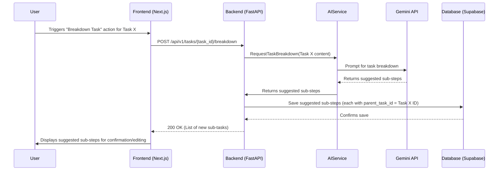
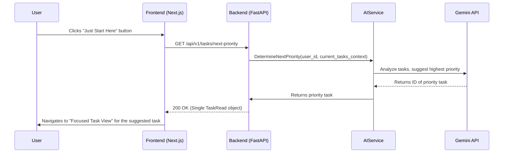
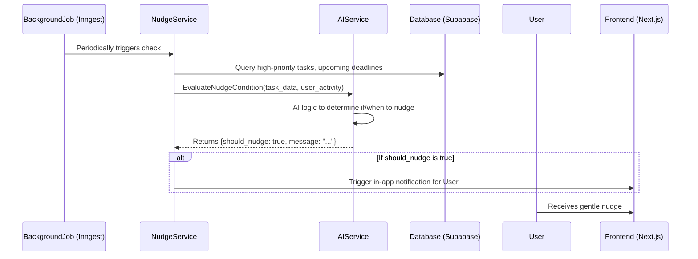

# Epic Technical Specification: AI-Enhanced Productivity Tools (ADHD Focus - Post-MVP)

Date: 2025-11-30
Author: BIP
Epic ID: epic-4
Status: Draft

---

## Overview

This epic, "AI-Enhanced Productivity Tools (ADHD Focus - Post-MVP)," represents a significant step towards the application's core mission of providing targeted support for users with executive function difficulties, such as ADHD. It focuses on delivering specialized AI-driven tools designed to reduce overwhelm, aid task initiation, improve time perception, and enhance focus. This epic covers Post-MVP functional requirements FR15, FR16, FR17, FR18, FR19, and FR20.

## Objectives and Scope

**In Scope:**

*   **FR15: AI Task Breakdown Suggestions:** Implement a mechanism (e.g., as part of the "Plan My Day" workflow) where the Gemini API suggests breaking down large tasks into smaller, actionable sub-steps. This will involve storing `parent_task_id` in the database.
*   **FR16: AI-Generated Time Estimates:** Integrate Gemini API calls to provide approximate time estimates for tasks, storing these in a new `estimated_time_minutes` field. This will also be part of the "Plan My Day" workflow.
*   **FR17: "Just Start Here" Button:** Develop backend logic to identify the highest priority, most actionable task using AI, and implement frontend UI to present this task in a "Focused Task View."
*   **FR18: Integrated Visual Timers:** Implement a client-side visual timer (e.g., Pomodoro) within the "Focused Task View" for focused work sessions. No direct backend persistence required in this epic for the timer state itself.
*   **FR19: Smart, Gentle Nudge Reminders:** Develop a backend mechanism (e.g., background job) that, using AI logic, determines appropriate moments to send gentle, context-aware notifications to users for high-priority tasks.
*   **FR20: Scheduled Task Management:** Leverage the `scheduled_date` field from Epic 3, providing UI components (e.g., date picker) to assign specific dates to tasks and display them prominently in relevant views (e.g., "Today" view).
*   **Backend AI Orchestration:** Implement the "Plan My Day" AI Workflow in the FastAPI backend to coordinate multiple AI calls and process responses for task breakdown and time estimates.

**Out of Scope:**

*   Any AI-powered features from Epic 2 or UI/UX features from Epic 3 (these are prerequisites or independent features).
*   Full customization of AI models or prompts by end-users.
*   Complex analytics or reporting features related to productivity patterns.
*   Advanced notification channels (e.g., SMS, email) beyond basic in-app notifications/toasts.

## System Architecture Alignment

This epic's implementation will strictly adhere to the established architectural patterns, primarily leveraging the AI integration framework and expanding database capabilities.

*   **AI Integration Strategy:** All AI-driven features (FR15, FR16, FR17, FR19) will exclusively use the **FastAPI backend** for secure communication with the Gemini 2.5 Pro API, managing prompts, and handling AI response processing, as mandated by the architecture (Section 3.1).
*   **Database Schema:** The `tasks` table will be extended to include `parent_task_id` for hierarchical tasks (FR15) and `estimated_time_minutes` (FR16), aligning with the database schema decisions (Architecture, Section 3.1).
*   **Background Jobs:** The implementation of Smart, Gentle Nudge Reminders (FR19) will align with the `Background Task Processing` decision (Architecture, Section 3.3), likely utilizing a recommended service like `Inngest` for serverless-friendly scheduling.
*   **Novel Architectural Patterns ("Plan My Day" AI Workflow):** This epic is a direct implementation and expansion of the "Plan My Day" AI Workflow (Architecture, Section 7), orchestrating various AI capabilities to create an actionable plan.
*   **Frontend/Backend Communication:** The Next.js frontend will consume the new and enhanced API endpoints for task breakdown, time estimates, "Just Start Here" logic, and scheduled task management via the established type-safe API client.

## Detailed Design

### Services and Modules

| Service / Module | Location | Responsibilities | Inputs | Outputs |
| :--- | :--- | :--- | :--- | :--- |
| **TaskService** | Backend (FastAPI) | Manages task CRUD operations, now incorporating hierarchical task relationships (`parent_task_id`), AI-generated `estimated_time_minutes`. Orchestrates AI calls for breakdown and "next priority" logic. | User ID, Task data, `parent_task_id`, `estimated_time_minutes` | Task objects, prioritized task |
| **AIService** | Backend (FastAPI) | Expanded to handle prompt construction and Gemini API calls for task breakdown, time estimation, and identifying the "next priority" task. Also contributes to context-aware nudges. | Task content, user history, current task list | Suggested sub-steps, time estimates, single priority task, nudge trigger conditions |
| **NudgeService** | Backend (FastAPI/Background Job) | Periodically queries user task data and activity. Uses AI logic from `AIService` to determine if a nudge is appropriate and triggers notifications. | User task data, activity status | Notification triggers |
| **TaskBreakdownComponent** | Frontend (React Component) | Displays AI-suggested sub-steps to the user for review and allows confirmation or editing before saving. | List of suggested sub-steps | User-confirmed sub-steps |
| **TimerComponent** | Frontend (React Component) | Provides an integrated visual timer (e.g., Pomodoro) within the "Focused Task View." Handles countdown and triggers end-of-session notifications. | Duration | Timer events (start, pause, end) |
| **JustStartHereButton** | Frontend (React Component) | Triggers the "Just Start Here" workflow to fetch and display the most important task. | Click event | API call to `GET /api/v1/tasks/next-priority` |

### Data Models and Contracts

**1. Database Schema (SQL)**

The `tasks` table will be extended to support hierarchical tasks and estimated time.

```sql
-- Add parent_task_id for hierarchical tasks
ALTER TABLE tasks ADD COLUMN parent_task_id BIGINT REFERENCES tasks(id) ON DELETE CASCADE;

-- Add estimated_time_minutes for AI-generated time estimates
ALTER TABLE tasks ADD COLUMN estimated_time_minutes INTEGER;
```

**2. API Data Contracts (Pydantic)**

The `TaskRead` model will include the new fields.

```python
from typing import List, Optional
from datetime import datetime
from pydantic import BaseModel

class TaskRead(BaseModel):
    id: int
    title: str
    is_completed: bool
    scheduled_date: Optional[datetime]
    parent_task_id: Optional[int] # New field
    estimated_time_minutes: Optional[int] # New field
    # ... other existing fields ...
    priority: Optional[int]
    labels: List[str] = []

    class Config:
        orm_mode = True
```

### APIs and Interfaces

New endpoints will support task breakdown, time estimates, and the "Just Start Here" feature.

**`POST /api/v1/tasks/{task_id}/breakdown` (New)**

*   **Description:** Triggers AI to break down the specified task into smaller sub-steps.
*   **Path Parameters:**
    *   `task_id` (integer, required): The ID of the task to break down.
*   **Request Body:** (Optional) Can include user preferences or context for breakdown.
*   **Success Response (200 OK):**
    *   **Body:** `List[TaskRead]`
    *   **Description:** Returns a list of AI-suggested sub-tasks (Task objects with `parent_task_id` set to `task_id`).

**`GET /api/v1/tasks/next-priority` (New)**

*   **Description:** Uses AI logic to identify the single most important and actionable task for the user based on current context, priorities, and estimates.
*   **Query Parameters:**
    *   `context` (string, optional): User-provided context (e.g., "energy level: low", "time: 30 minutes free").
*   **Success Response (200 OK):**
    *   **Body:** `TaskRead`
    *   **Description:** Returns a single `TaskRead` object representing the next priority task. Returns 204 No Content if no suitable task is found.

### Workflows and Sequencing

**1. AI Task Breakdown Workflow**



**2. "Just Start Here" Workflow**



**3. Smart Nudge Reminder Workflow**



## Non-Functional Requirements

### Performance

*   **AI Latency:** Gemini API calls for task breakdown, time estimates, and "next priority" logic **MUST** be optimized to minimize user waiting time. Asynchronous processing in the backend (e.g., FastAPI `BackgroundTasks`) is crucial to avoid blocking the main request-response cycle. Target API response time (excluding AI call) of under 100ms.
*   **Background Job Efficiency:** Nudge reminder background jobs **MUST** run efficiently, minimizing database queries and AI calls per cycle to avoid resource contention and ensure timely delivery of nudges.
*   **Frontend Timers:** Integrated visual timers **MUST** be precise and not impact the overall UI responsiveness or introduce jank. They should operate smoothly even if the user navigates away from the active browser tab (e.g., using Web Workers if necessary).

### Security

*   **AI Prompt Security:** Prompts constructed for the Gemini API **MUST NOT** contain directly identifiable or sensitive user data. User-specific context should be carefully abstracted or anonymized where possible.
*   **Nudge Logic Privacy:** AI logic for nudge reminders **MUST** strictly adhere to user privacy. It should only access and analyze data strictly necessary to determine appropriate nudge conditions, as defined by user consent.
*   **Data Isolation:** Hierarchical task relationships (`parent_task_id`) **MUST** respect Row Level Security (RLS) on the `tasks` table, ensuring users can only view or modify their own task hierarchies.

### Reliability/Availability

*   **AI Service Fallback:** All AI-driven features (task breakdown, time estimates, "next priority" determination) **MUST** implement robust fallback mechanisms. If the Gemini API is unavailable, returns invalid responses, or times out, the core application functionality should not fail. Instead, it should log the error and proceed without the AI-enhanced features, providing appropriate default behavior or user feedback.
*   **Background Job Resilience:** The nudge reminder background job **MUST** be fault-tolerant, with built-in retry mechanisms for transient errors and comprehensive error handling for permanent failures. It should not fail silently or lose state.
*   **Timer Accuracy:** Client-side timers **MUST** maintain reasonable accuracy despite browser tab inactivity, system resource limitations, or device sleep states.

### Observability

*   **AI Interaction Logging:** Detailed logging of all Gemini API interactions **MUST** be implemented. This includes the full prompt sent, the raw response received, the calculated latency, and any errors encountered. This data is critical for debugging, prompt engineering refinement, and auditing.
*   **Background Job Monitoring:** Comprehensive monitoring of the nudge reminder background job (e.g., execution frequency, duration, success/failure rates, triggered nudges) **MUST** be in place to ensure its operational health.
*   **Nudge Effectiveness Metrics:** Collect anonymous metrics on nudge delivery and user engagement (e.g., click-through rates, task completion rates after a nudge) to evaluate effectiveness and iteratively improve the AI logic for context-aware reminders.

## Dependencies and Integrations

This epic introduces new core dependencies and integrations to support the advanced AI-driven features.

### Backend Dependencies (FastAPI - `requirements.txt`)

*   **`google-generativeai`**: Essential for programmatic access to the Gemini 2.5 Pro API for task breakdown, time estimates, "next priority" logic, and nudge AI.
*   **`fastapi`**: Core framework for building the backend API.
*   **`uvicorn`**: ASGI server to run the FastAPI application.
*   **`supabase-py`**: Client library for interacting with the Supabase database.
*   **`pydantic`**: For data validation and settings management.
*   **`inngest`**: (New, as per Architecture Section 3.3) Recommended for serverless background job orchestration, crucial for implementing smart nudge reminders.

### Frontend Dependencies (Next.js - `package.json`)

*   **`@supabase/supabase-js`**: Client library for Supabase authentication and real-time features.
*   **`zustand`**: For efficient global state management in the React frontend.
*   **`next`**: React framework for building the frontend application.
*   **`react`**, **`react-dom`**: Core React libraries.
*   **`tailwindcss`**, **`postcss`**, **`autoprefixer`**: For styling with utility-first CSS.
*   **`shadcn/ui`**: Provides accessible and customizable UI components.
*   **`react-timer-hook`**: (New) A React hook for implementing timers, suitable for integrated visual timers.

### Key Integrations

*   **Gemini API (Google)**: Primary integration for all AI-powered features in this epic. All communication will be server-side (FastAPI).
*   **Supabase**: Continues to serve as the database and authentication provider.
*   **Inngest**: (New) Integrated for robust, serverless background job execution, specifically for nudge reminders.
*   **Vercel**: Deployment platform for the monorepo.

## Acceptance Criteria (Authoritative)

**Story 4.1: AI Task Breakdown Suggestions**

1.  Given I have an unstructured task (e.g., "Plan my vacation") and trigger the "Plan My Day" AI Workflow, when the FastAPI backend orchestrates the AI call to Gemini 2.5 Pro, then Gemini generates a list of smaller, actionable sub-steps.
2.  Given these sub-steps are presented to me in the UI, when I confirm them, then they are added to my `tasks` table with their `parent_task_id` linked to the original larger task.

**Story 4.2: AI-Generated Time Estimates**

1.  Given I create or edit a task, or trigger the "Plan My Day" AI Workflow, when the FastAPI backend calls the Gemini API for task analysis, then Gemini provides an approximate time estimate (e.g., "15 minutes," "1 hour").
2.  Given a task has a time estimate, when the task is displayed in the UI, then the estimate is clearly displayed alongside the task title.

**Story 4.3: "Just Start Here" Button**

1.  Given I am on the "Proactive Dashboard" or any task view, when I click the prominent "Just Start Here" button, then the frontend makes a `GET` request to a backend endpoint (e.g., `/api/v1/tasks/next-priority`).
2.  Given the backend applies AI logic to identify the highest priority, most actionable task (considering various factors like deadline, estimated time, and current context), when the frontend receives this task, then the UI transitions to a "Focused Task View" for that specific task.

**Story 4.4: Integrated Visual Timers**

1.  Given I am in the "Focused Task View" for a specific task, when I activate a Pomodoro timer (e.g., 25 minutes), then a subtle, visual countdown is displayed within the Focused Task View.
2.  Given the timer completes, when the session ends, then a gentle, non-intrusive notification prompts me to take a break or extend the session.

**Story 4.5: Smart, Gentle Nudge Reminders**

1.  Given a high-priority task is approaching its due time, when I am not actively engaging with the application, then the FastAPI backend service, using AI logic, determines an appropriate moment to send a gentle, non-judgmental notification.
2.  Given a notification is received (e.g., a toast notification or push notification), when I interact with it, then I am directed back to the relevant task within the application.

**Story 4.6: Scheduled Task Management**

1.  Given I have a task, when I edit it, then I can assign a specific `scheduled_date` (or `due_date`) to it via a UI date picker.
2.  Given tasks are scheduled, when the scheduled day arrives, then these tasks are prominently displayed in relevant views (e.g., "Today" view on the "Proactive Dashboard").

## Traceability Mapping

| Acceptance Criteria                                                                                      | Spec Section(s)                                   | Component(s)/API(s)                                                       | Test Idea                                                                                                     |
| :------------------------------------------------------------------------------------------------------- | :------------------------------------------------ | :------------------------------------------------------------------------ | :------------------------------------------------------------------------------------------------------------ |
| AC 4.1.1: Backend orchestrates AI call for sub-steps generation.                                         | 4.4.1 (Workflow 1), 4.1 (Services)                | `AIService`, Gemini API, `POST /api/v1/tasks/{task_id}/breakdown`       | Integration test: Call breakdown API, mock Gemini, verify AI invocation.                                      |
| AC 4.1.2: Sub-steps presented in UI, confirmed, added to tasks with `parent_task_id`.                      | 4.2.1 (Data Models), 4.4.1 (Workflow 1)           | `TaskBreakdownComponent`, `TaskService`, Database                         | E2E test: Trigger breakdown, confirm sub-steps, verify DB entries (parent_task_id).                           |
| AC 4.2.1: Backend calls Gemini for time estimate.                                                        | 4.4.1 (Workflow 1), 4.1 (Services)                | `AIService`, Gemini API                                                   | Integration test: Call breakdown/creation API, mock Gemini, verify time estimate returned.                    |
| AC 4.2.2: Task displayed with time estimate.                                                             | 4.2.1 (Data Models)                               | UI Component                                                              | UI test: Verify `estimated_time_minutes` is visible on task card.                                           |
| AC 4.3.1: Frontend makes `GET /api/v1/tasks/next-priority`.                                              | 4.4.2 (Workflow 2)                                | `JustStartHereButton`, `GET /api/v1/tasks/next-priority`                  | E2E test: Click button, intercept network request to verify correct API call.                                 |
| AC 4.3.2: Backend identifies priority task; UI transitions to Focused View.                              | 4.4.2 (Workflow 2), 4.1 (Services)                | `AIService`, `TaskService`, Frontend Router                               | Integration test: Backend returns priority task. E2E: UI transitions to Focused View for that task.         |
| AC 4.4.1: Activate Pomodoro timer, visual countdown displayed.                                           | 4.1 (Services)                                    | `TimerComponent`                                                          | UI test: Activate timer, verify countdown display and accuracy.                                               |
| AC 4.4.2: Timer completes, gentle notification prompts break/extend.                                     | 4.1 (Services), UX Spec Nudges                    | `TimerComponent`, Notification Service                                    | UI test: Timer completes, verify gentle notification appears and is dismissible.                              |
| AC 4.5.1: Backend AI logic determines appropriate nudge moment.                                          | 4.4.3 (Workflow 3), 4.1 (Services)                | `NudgeService`, `AIService`, Background Job (`Inngest`)                   | Integration test: Simulate task conditions/user inactivity, verify nudge logic triggers (mocking).            |
| AC 4.5.2: Notification received, interaction directs to relevant task.                                   | 4.4.3 (Workflow 3), UX Spec Nudges                | `NudgeService`, Notification Service, Frontend Router                     | E2E test: Receive in-app nudge, click it, verify correct navigation to task.                                  |
| AC 4.6.1: Assign `scheduled_date` via UI date picker.                                                    | 4.2.1 (Data Models), 4.1 (Services)               | `DatePicker` component, `TaskService`, `PUT /api/v1/tasks/{task_id}`      | UI/E2E test: Use date picker to assign date, verify task update API call and DB persistence.                 |
| AC 4.6.2: Scheduled tasks prominently displayed in relevant views.                                       | 4.4.1 (Workflow from Epic 3), 4.2.1 (Data Models) | `TaskStateService`, `GET /api/v1/tasks?scheduled_date`, UI Components     | E2E test: Schedule task, verify it appears correctly in "Today" view and other relevant lists.                |

## Risks, Assumptions, Open Questions

*   **Risk:** Over-reliance on AI for critical decision-making features (e.g., "Just Start Here" button) could lead to user dissatisfaction if AI suggestions are consistently poor, irrelevant, or misaligned with actual user intent.
    *   **Mitigation:** Provide clear, easily accessible user override mechanisms for all AI suggestions. Continuously collect user feedback to refine AI prompts and models. Ensure transparency regarding AI's role and limitations.
*   **Risk:** The background job for nudge reminders (FR19) might be difficult to test and debug duese to its asynchronous, scheduled, and context-dependent nature, potentially leading to missed nudges or irrelevant reminders.
    *   **Mitigation:** Implement comprehensive logging and monitoring specifically for the background job execution and nudge delivery. Develop dedicated integration tests that simulate various time-based and user activity conditions to trigger nudge logic.
*   **Assumption:** The Gemini API provides sufficiently nuanced understanding of task context to generate helpful breakdowns, accurate time estimates, and effective prioritization without excessive manual prompt engineering effort for each new feature.
    *   **Mitigation:** Conduct early spikes on each new AI feature to validate prompt effectiveness against a diverse set of real-world task scenarios and refine prompts iteratively.
*   **Open Question:** How will user feedback on AI suggestions (e.g., correcting an AI breakdown, adjusting a time estimate, or dismissing an irrelevant nudge) be captured and leveraged to improve the underlying AI models or prompts over time?
    *   **Next Step:** Design and implement a feedback loop mechanism for future iterations, potentially storing user corrections or explicit feedback for offline model training or prompt adjustment. This could involve a simple "Was this helpful?" prompt.
*   **Open Question:** What is the most effective strategy for handling sensitive or private task content (e.g., medical appointments, financial details) when sending prompts to the Gemini API for analysis, given the privacy NFRs?
    *   **Next Step:** Revisit AI prompt security and nudge logic privacy (NFRs) to establish clear guidelines. Explore techniques like local pre-processing to redact sensitive information before sending to the AI, or provide explicit user controls to opt-out of AI analysis for specific tasks/lists.

## Test Strategy Summary

The testing strategy for Epic 4 will be highly focused on the correctness, reliability, and user impact of the AI-enhanced productivity tools, integrating robust testing across all layers.

*   **Unit Tests:**
    *   **Backend (`pytest`):** Cover `TaskService` (handling `parent_task_id`, `estimated_time_minutes`), `AIService` (mocking Gemini API for prompt construction, response parsing for breakdown, estimates, priority, nudge conditions), and `NudgeService` (mocking task data and user activity to test core nudge logic).
    *   **Frontend (`Jest`, `React Testing Library`):** Test `TaskBreakdownComponent` (rendering sub-steps, user confirmation), `TimerComponent` (countdown logic, notifications), and `JustStartHereButton` (click events, state updates).
*   **Integration Tests:**
    *   **Backend API:** Test `POST /api/v1/tasks/{task_id}/breakdown` (end-to-end AI invocation and database update), `GET /api/v1/tasks/next-priority` (AI-based task selection), and the internal logic of `NudgeService` (mocking dependencies) to ensure correct interaction between services.
    *   **Background Jobs:** Dedicated tests for the `NudgeService` background job to verify it correctly queries the database, processes data, and triggers notifications based on defined schedules and AI logic.
*   **End-to-End Tests (`Playwright`)**:
    *   **Critical User Journeys:** Simulate triggering task breakdown, confirming sub-steps, verifying `parent_task_id` relationships. Clicking "Just Start Here" and verifying UI transition to the correct "Focused Task View." Activating timers and verifying notifications. Simulating conditions for nudge reminders and verifying their appearance and interaction.
    *   **Scheduled Task Management:** Create tasks with `scheduled_date`, verify their appearance in the "Today" view.
*   **AI-Specific Testing:**
    *   **Regression Testing:** Maintain a curated set of test tasks with expected AI-generated breakdowns, time estimates, and priorities. Regularly run these to detect any degradation in AI quality or changes in behavior due to prompt adjustments or model updates.
    *   **Error Handling:** Test `AIService` resilience to various Gemini API responses (malformed, errors, timeouts).
*   **Performance Testing:**
    *   Measure latency of Gemini API calls within the backend workflows. Load test the `POST /api/v1/tasks/{task_id}/breakdown` and `GET /api/v1/tasks/next-priority` endpoints.
    *   Monitor background job execution times for `NudgeService`.
*   **Security Testing:**
    *   Verify that AI prompts are sanitized and do not inadvertently send sensitive user data to external AI services.
    *   Confirm that RLS policies are enforced for all hierarchical task data and "next priority" queries.
